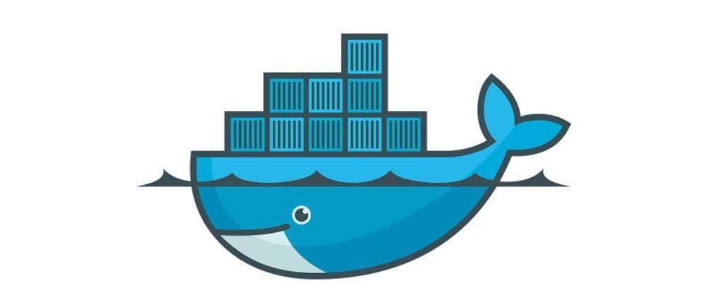

# **¿QUÉ ES DOCKER?**



Docker es una herramienta de [**código abierto**][1_0] que sirve para empaquetar una aplicación incluyendo sus dependencias, este se usa para automatizar el despliegue de las aplicaciones dentro de unos [**contenedores de software**][1_1], proporcionando a así una capa extra de abstracción y de automatización para la virtualización de las aplicaciones en los distintos sistemas operativos, permitiendo una mejor flexibilidad y portabilidad en donde se puedan ejecutar las aplicaciones.

Este también suele utilizar algunas características de aislamiento de recursos del [**kernel Linux**][1_2], tales como [**cgroup**][1_3] y [**namespaces (espacios de nombres)**][1_4], para así permitir que los contenedores independientes se ejecuten dentro de una sola instancia de Linux, para así evitar una sobre carga a la hora de iniciar y mantener la [**máquina virtual**][1_5].

Además, el soporte del kernel Linux para los namespaces sirve para aislar la vista que tiene una aplicación de su entorno operativo, incluyendo los árboles de procesos, la red, el ID de los usuarios y de los sistemas de archivos montados, mientras que los cgroups del kernel proporcionan un aislamiento de recursos que incluye la memoria, la red, el CPU y el bloque de entrada y salida.

[1_0]:https://es.wikipedia.org/wiki/C%C3%B3digo_abierto

[1_1]:https://es.wikipedia.org/wiki/Virtualizaci%C3%B3n_a_nivel_de_sistema_operativo

[1_2]:https://es.wikipedia.org/wiki/N%C3%BAcleo_Linux

[1_3]:https://es.wikipedia.org/wiki/Espacio_de_nombres

[1_4]:https://es.wikipedia.org/wiki/M%C3%A1quina_virtual

[1_5]:https://clibre.io/blog/por-secciones/hardening/item/425-cgroups-grupos-de-control-en-gnu-linux

## **REQUISITOS DE DOCKER**

Los requisitos mínimos de Docker son:

* Sistema operativo Windows 10 de 64 bits: Home o Pro (compilación 19041 o posterior), Enterprise o Education (compilación 18363 o posterior). Windows 11 de 64 bits: Home, Pro, Enterprise o Education versión 21H2 o posterior.

* Procesador de 64 bits con [**traducción de direcciones de segundo nivel (SLAT)**][2_0].

* Memoria RAM de 4 GB.

* El [**soporte de virtualización**][2_1] debe estar habilitado en la configuración del [**BIOS**][2_2].

* Las características de [**Hyper-V**][2_3] y [**Containers Windows**][2_4] deben estar habilitadas.

[2_0]:https://es.abcdef.wiki/wiki/Second_Level_Address_Translation

[2_1]:https://es.wikipedia.org/wiki/Virtualizaci%C3%B3n

[2_2]:https://es.wikipedia.org/wiki/BIOS

[2_3]:https://es.wikipedia.org/wiki/Hyper-V

[2_4]:https://docs.microsoft.com/es-es/virtualization/windowscontainers/about/

## **ARQUITECTURA DE DOCKER**

Docker cuenta con una arquitectura de **servidor** - **cliente**. Donde se tiene que el cliente es **Docker Client** **(interfaz de línea de comandos)** y el proceso del servidor es **Docker Daemon** el cual se ejecuta en el host. por otra parte, se tiene que tanto el servidor como el cliente pueden estar en la misma computadora.

En el siguiente diagrama se pueden observar algunos componentes principales de la arquitectura que conforma una plataforma de Docker, en la cual se puede observar como el usuario ordena el demonio de Docker atreves de un cliente, etc.


A continuación, una breve explicación de los componentes que conforman una arquitectura Docker:

1. **Docker Engine:** Este es la parte central de todo el sistema Docker y También es una aplicación que sigue una arquitectura cliente-servidor que está instalado en la máquina host.

    Existen tres componentes en Docker Engine los cuales son:

    * **Servidor:** Este es el demonio de la ventana acoplable llamado [**Dockerd**][3_0], este puede crear y administrar imágenes de la ventana acoplable, contenedores, redes, etc.

    * **API de descanso:** Este se utiliza para indicarle al demonio de la ventana acoplable qué hacer.

    * **Interfaz de línea de comandos (CLI):** Este es un cliente que se usa para ingresar comandos de Docker.

[3_0]:https://runebook.dev/es/docs/docker/engine/reference/commandline/dockerd/index

1. **Cliente Docker:** Los usuarios de pueden interactuar con Docker a través de un cliente que cuando ejecuta cualquier comando de Docker, el cliente los envía al demonio Dockerd, que los ejecuta y estos comandos de se utilizan en una API de Docker, También el cliente de Docker puede comunicarse con más de un demonio.

1. **Docker Daemon:** Este hace todo el trabajo pesado, creando imágenes de Docker, extrayendo imágenes del registro y ejecutando contenedores con imágenes. También, se puede acceder a este través del Docker Client.

1. **Registros de Docker:** Este es la ubicación donde se almacenan las imágenes de Docker. Puede ser un registro de ventana acoplable público o un registro de ventana acoplable privado. También es el lugar predeterminado de las imágenes de la ventana acoplable y del registro público de sus tiendas. Además de crear y ejecutar su propio registro privado.

    Cuando se ejecutan los comandos `docker pull` o `docker run`, la imagen de la ventana acoplable requerida se extrae del registro configurado y cuando se ejecuta el comando `docker push`, la imagen de la ventana acoplable se almacena en el registro configurado.

## **OBJETOS DOCKER**

Cuando se trabaja con Docker se suelen usar los siguientes objetos:

1. **Imágenes:** Las imágenes de Docker son plantillas de solo lectura con instrucciones para crear un contenedor de Docker. La imagen de Docker puede extraerse de un concentrador de Docker y usarse tal como está, o puede agregar instrucciones adicionales a la imagen base y crear una imagen de Docker nueva y modificada. Puede crear sus propias imágenes de la ventana acoplable también utilizando un archivo acoplable. Cree un [**dockerfile**][4_0] con todas las instrucciones para crear un contenedor y ejecutarlo; creará su imagen de ventana acoplable personalizada.

    La imagen de Docker tiene una capa base que es de solo lectura y la capa superior se puede escribir. Cuando edita un archivo Docker y lo reconstruye, solo la parte modificada se reconstruye en la capa superior.

[4_0]:https://openwebinars.net/blog/que-es-dockerfile/

1. **Contenedores:** Después de ejecutar una imagen de la ventana acoplable, crea un contenedor de la ventana acoplable. Todas las aplicaciones y su entorno se ejecutan dentro de este contenedor. Puede usar la [**API**][4_1] o la [**CLI**][4_2] de Docker para iniciar, detener y eliminar un contenedor de Docker.

    A continuación, se muestra un comando de muestra para ejecutar un contenedor Docker de Ubuntu:

    ```
    docker run -i -t ubuntu /bin/bash
    ```

[4_1]:https://es.wikipedia.org/wiki/Interfaz_de_programaci%C3%B3n_de_aplicaciones

[4_2]: https://es.wikipedia.org/wiki/Interfaz_de_l%C3%ADnea_de_comandos

1. **Volúmenes:** Los datos persistentes generados por Docker y utilizados por los contenedores de Docker se almacenan en Volumes. Están completamente administrados por Docker a través de Docker CLI o Docker API. Los volúmenes funcionan en contenedores de Windows y Linux. En lugar de conservar los datos en la capa de escritura de un contenedor, siempre es una buena opción utilizar volúmenes para ello. El contenido del volumen existe fuera del ciclo de vida de un contenedor, por lo que usar el volumen no aumenta el tamaño de un contenedor.

    Puede usar el indicador `-v` o `–mount` para iniciar un contenedor con un volumen. En este comando de muestra, está usando geekvolume volume con el contenedor geekflare.

    ```
    docker run -d --name geekflare  -v geekvolume:/app nginx:latest
    ```

1. **Redes:** La red Docker es un pasaje a través del cual se comunican todos los contenedores aislados. Hay principalmente cinco controladores de red en la ventana acoplable:

    * **Puente:** Es el controlador de red predeterminado para un contenedor. Utiliza esta red cuando su aplicación se ejecuta en contenedores independientes, es decir, varios contenedores que se comunican con el mismo host de la ventana acoplable.

    * **Anfitrión:** Este controlador elimina el aislamiento de red entre los contenedores de la ventana acoplable y el host de la ventana acoplable. Se utiliza cuando no necesita ningún aislamiento de red entre el host y el contenedor.

    * **Superposición:** Esta red permite que los servicios de enjambre se comuniquen entre sí. Se utiliza cuando los contenedores se ejecutan en diferentes hosts de Docker o cuando los servicios de enjambre están formados por múltiples aplicaciones.

    * **Ninguna:** Este controlador desactiva todas las redes.

    * **Macvlan:** Este controlador asigna direcciones mac a los contenedores para que parezcan dispositivos físicos. El tráfico se enruta entre contenedores a través de sus direcciones mac. Esta red se utiliza cuando desea que los contenedores se vean como un dispositivo físico, por ejemplo, al migrar una configuración de VM.

---

## **Mas información**

* [Docker (software)][5_0]

* [Docker Desktop system requirements (Windows, macOS)][5_1]

* [Docker Architecture y sus componentes para principiantes][5_2]

* [ARQUITECTURA DE DOCKER][5_3]

[5_0]:https://es.wikipedia.org/wiki/Docker_(software)

[5_1]:https://www.kindacode.com/article/docker-desktop-system-requirements-windows-macos/

[5_2]:https://geekflare.com/es/docker-architecture/

[5_3]:https://purocode.com/arquitectura-de-docker/