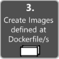

# **Workflow for developing Docker container-based applications**

El Workflow es el flujo de trabajo de ciclo interno significa que no esta considerando el flujo de trabajo de [DevOps][1.1] mas amplio, puede incluir hasta la implementacion de producción, y solo se enfoca en el trabajo de desarrollo realizado en la computadora del desarrollador.

una aplicacion se compone de sus propios servicios mas bibliotecas adicionales (dependencias).

## Flujo de trabajo paso a paso para desarrollar aplicaciones en contenedores Docker

En esta imagen podemos observar todo un flujo de trabajo que se utiliza para desarrollar aplicaciones en los contenedores de Docker y la manera en pasos de como se debe ejecutar la accion.

Si usa Visual Studio 2022, muchos de estos procesos se encargan de usted, lo que hace que su productividad sea mucho mejor. Esto es especialmente cierto cuando se usa Visual Studio 2022 y se dirige a varios contenedores. Por ejemplo, Visual Studio agrega `Dockerfile ` que contienen configuraciones de aplicaciones a su proyecto con un solo clic. `docker-compose.yml ` Cuando esta aplicación se ejecuta en Visual Studio, crea una imagen de Docker y ejecuta varios contenedores directamente desde Docker. Puede empacar varias bolsas a la vez. Estas características aceleran su desarrollo.

sin embargo, el que la herramienta nos brinde tanta facilidad, no significa que no debamos saber como funciona internamente el proceso Docker, por lo que en esta documentacion desglosaremos teoricamente la funcionalidad de los pasos anteriormente mostrados.

# **Paso 1: Code your app**

Crear una aplicación Docker es lo mismo que crear una aplicación sin Docker. La diferencia es que construye Docker, instala y prueba aplicaciones o servicios que se ejecutan en contenedores Docker en su entorno (o una máquina virtual Linux instalada con Docker, o Windows directamente si usa contenedores de Windows).

# **Paso 2: Write Dockerfile/s**

Necesita un Dockerfile para cada imagen personalizada que desee crear. También necesita un Dockerfile para cada contenedor implementado, ya sea una implementación automática desde Visual Studio o una implementación manual mediante la CLI de Docker (comandos docker-run y docker-compose). Si la aplicación contiene un servicio de usuario, se requiere un Dockerfile. Si su aplicación abarca varios servicios (por ejemplo, en una arquitectura de microservicio), se requiere un Dockerfile para cada servicio.
El Dockerfile se coloca en la carpeta raíz de la aplicación o servicio. Contiene comandos que le indican a Docker cómo configurar y ejecutar una aplicación o servicio en un contenedor. Puede crear un Dockerfile manualmente en su código y agregarlo a su proyecto junto con las dependencias de .NET.

# **Paso 3: Create Images defined at Dockerfile/s**

Para cada función en su aplicación, necesita crear una imagen correspondiente. Si su aplicación tiene un servicio o conexión a Internet, solo necesita una imagen.

Tenga en cuenta que las imágenes de Docker se crean automáticamente en Visual Studio. Los siguientes pasos son importantes para la funcionalidad del editor/línea de comandos y se explican para mostrar lo que sucedió.

Como desarrollador, debe compilar y probar localmente hasta que libere todas las funciones o cambie su sistema de administración (como GitHub). Por lo tanto, debe crear imágenes de Docker e implementar contenedores en un host de Docker local (VM Windows o Linux) y ejecutar, probar y configurar los contenedores localmente.

[1.1]:https://www.netapp.com/es/devops-solutions/what-is-devops/