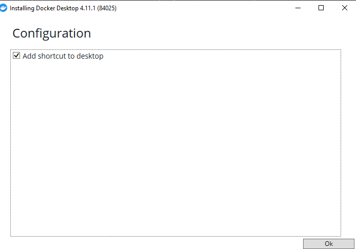
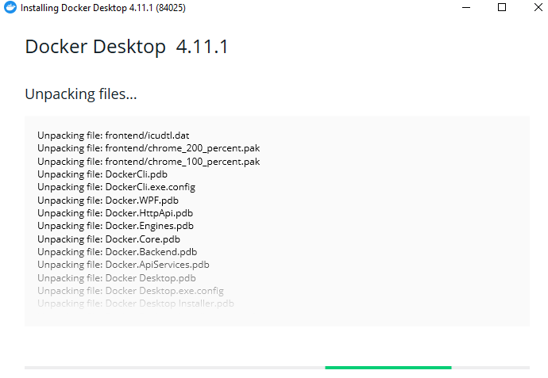
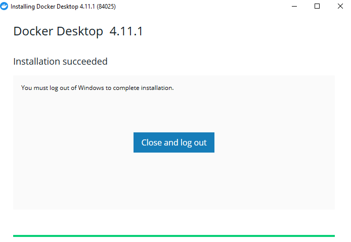
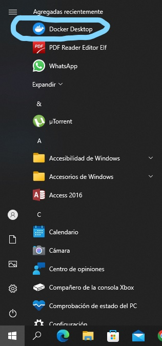
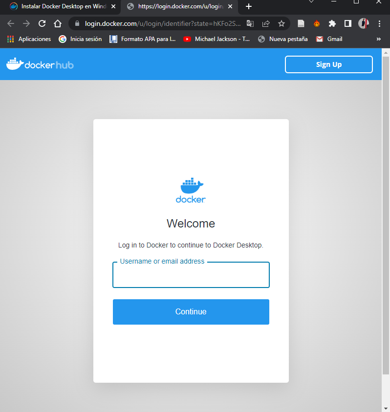
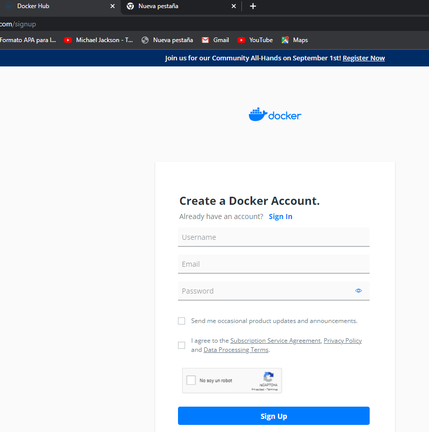
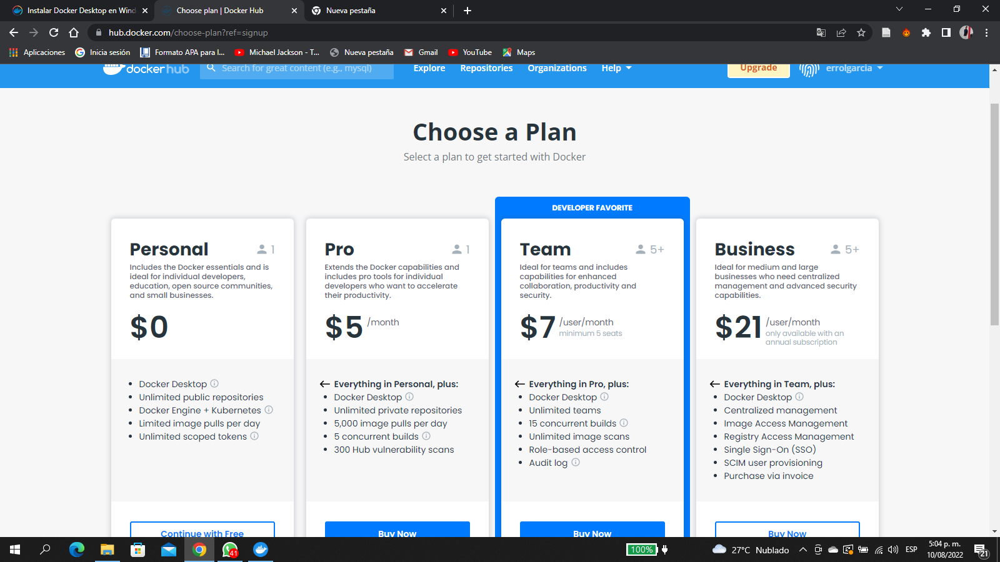
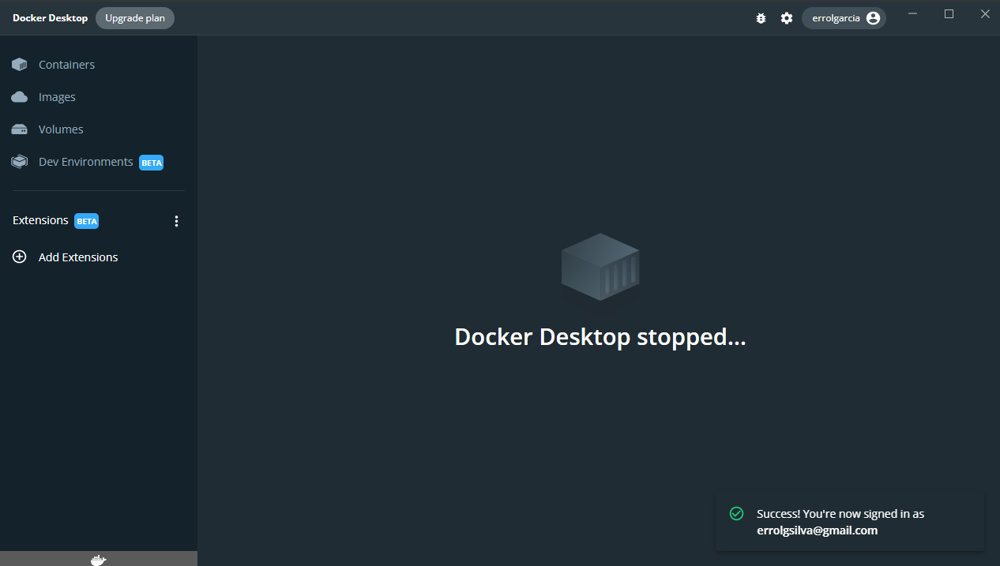

 <h1> **Instalación Docker** </h1>
<h2> 
    Requisitos del sistema
</h2>

Para realizar la instalación, vamos a necesitar ya tener previamente insalado en nuestro SO Windows el servidor WSL 2 y aqui se necesitaran otros requisitos

* Windows 11 de 64 bits: Home o Pro versión 21H2 o superior, o Enterprise o Education versión 21H2 o superior.

* Windows 10 de 64 bits: Home o Pro 21H1 (compilación 19043) o superior, o Enterprise o Education 20H2 (compilación 19042) o superior.

* Habilite la función WSL 2 en Windows. Para obtener instrucciones detalladas, consulte la documentación de Microsoft .

* Se requieren los siguientes requisitos previos de hardware para ejecutar correctamente WSL 2 en Windows 10 o Windows 11:

    * Procesador de 64 bits con traducción de direcciones de segundo nivel (SLAT) 

    * RAM del sistema de 4GB

    * El soporte de virtualización de hardware a nivel de BIOS debe estar habilitado en la configuración del BIOS. Para obtener más información, consulte Virtualización .

    * Descargue e instale el paquete de actualización del kernel de Linux .

<body>
    <h2> 
     
Install Docker Desktop on Windows

    </h2>
    <h3>
     
Instalación interactiva

    </h3>

</body>
En este proceso de instalación vamos a realizarla interactivamente por medio del paso a paso que nos provee la interfaz del instalador de Docker; los pasos que seguiremos los revisaremos a continuación:

 * Para empezar con la instalación debemos decargar el [ejecutable de Docker][1.1] y abrimos:

    

* Para esta instalacion interactiva marcamos la casilla para que se pueda añadir un acceso directo al escritorio.
    

* En este momento empieza el unpacking file de Docker
    

* como se puede apreciar la instalacion tiene pocos pasos, y no se demora en desempaquetar los archivos de docker.

    le pide cerrar para completar completar la instalación. 
    

* teniendo en cuenta, la marca del check que hizo anteriormente, le queda anclado el acceso directo para poder abrirlo rapidamente
    

* se abrira una ventana en el navegador para loguearnos y poder autentificar la cuenta con el Docker que acabamos de instalar, si no tenemos una cuenta docker, damos clic en el boton para registrarnos ([sing in][1.2])
    

* Aqui crearemos nuestra cuenta docker para poder ingresar a la gran cadena de ventajas que nos brinda Docker
    

* En este paso, simplemente tendras que clasificarte en el plan que deseas escoger, ya sea personal, profesional, Un quipo o de negocio.

* Finalmente, al momento de ejecutar el acceso directo de Docker Desktop accederemos a nuestra cuenta docker y podremos utilizar normalmente la herramienta. 
    

[1.1]:https://desktop.docker.com/win/main/amd64/Docker%20Desktop%20Installer.exe

[1.2]:https://hub.docker.com/

# Mas recursos

* [Docker Documents][1.3]

[1.3]:https://docs.docker.com/desktop/install/windows-install/