# **Instalación Docker**

Para realizar la instalación, necesitaremos tener previamente instalado en nuestro SO Windows el servidor [**WSL 2**][1_0] y aquí se necesitarán otros requisitos tales como:

[1_0]:https://github.com/JhonFabioEC/WSL2/tree/main/3-Instalacion

* Windows 10 de 64 bits: Home o Pro 21H1 (compilación 19043) o superior, o Enterprise o Education 20H2 (compilación 19042) o superior.

* Windows 11 de 64 bits: Home o Pro versión 21H2 o superior, o Enterprise o Education versión 21H2 o superior.

* Habilitar la función WSL 2 en Windows.

* Se requieren los siguientes requisitos previos de hardware para ejecutar correctamente WSL 2 en Windows 10 o Windows 11:

    * Procesador de 64 bits con traducción de direcciones de segundo nivel (SLAT).

    * RAM del sistema de 4 GB.

    * El soporte de virtualización de hardware a nivel de BIOS debe estar habilitado en la configuración del BIOS.

    * Descargar e instalar el paquete de actualización del kernel de Linux.

## **Instalación interactiva**

Este proceso de instalación lo realizaremos de manera interactiva, es decir por medio del paso a paso que nos provee la interfaz del instalador de **Docker**; los pasos que seguiremos los revisaremos a continuación:

* Para empezar con la instalación debemos descargar el [**ejecutable de Docker**][1_1] desde su página oficial y una vez que lo hemos descargado procederemos a abrirlo para así dar inicio a la instalación.

[1_1]:https://desktop.docker.com/win/main/amd64/Docker%20Desktop%20Installer.exe

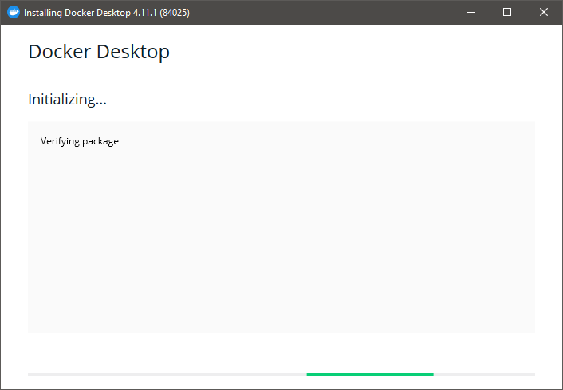

* Para esta instalación macaremos la casilla de **Use WSL 2 instead of Hyper-V (recommended)** y la casilla de **Add shortcut to desktop** donde esta última servirá para añadir un acceso directo en el escritorio.

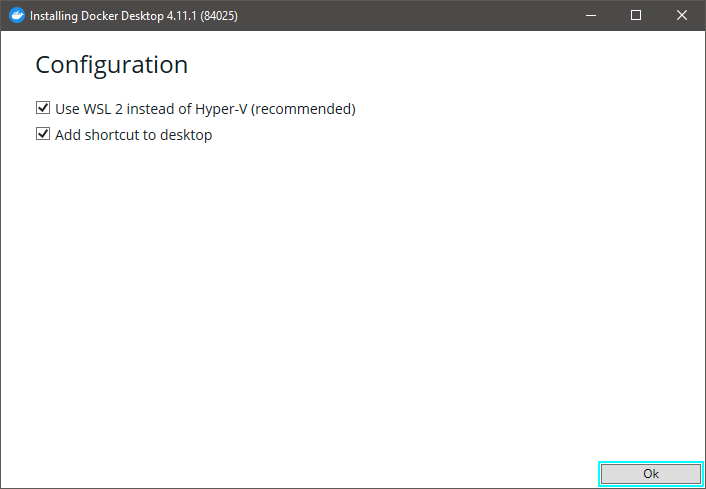

* Una vez hecho esto, empezará un **Unpacking files  (desempaquetamiento de los archivos)** de Docker.

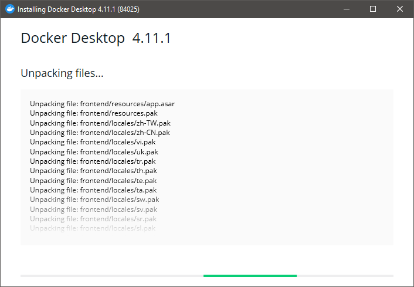

* Luego de desempaquetar los archivos, procederá a instalar esos paquetes.

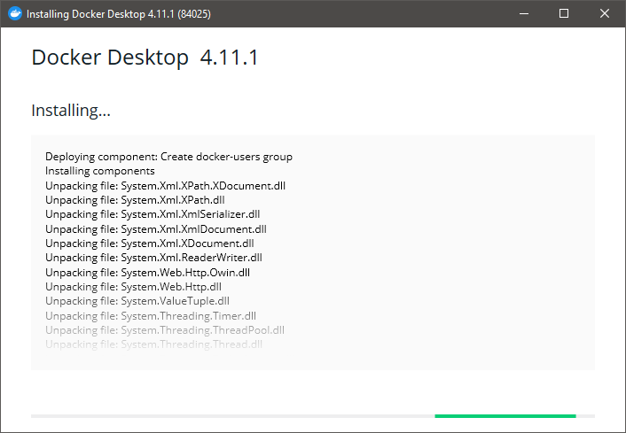

* Una vez que termine la instalación, nos saldrá un mensaje que dice **Installation succeeded (instalación exitosa)** y luego de esto tendremos que dar un clic en **Close and log out (Cerrar y cerrar sección)** para así completar la instalación.

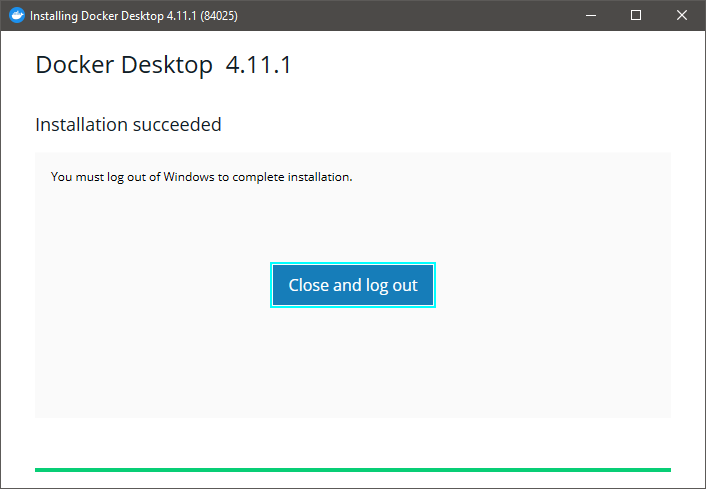

* Para abrir el programa, lo podremos hacer desde el acceso directo que se creó anteriormente o también desde el inicio de Windows, en nuestro caso lo haremos desde esta última y procederemos a darle un clic izquierdo en la que dice **Docker Desktop** para abrirlo.

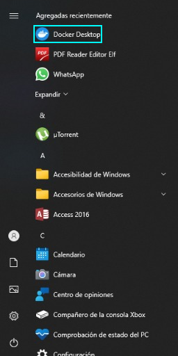

* Una vez que lo hemos abierto, se nos desplegara una ventana en la que tendremos que aceptar los términos y condiciones de Docker para así poder continuar, esto lo haremos marcando la casilla de **I accept the terms (acepto los términos)** y luego procederemos a dar un clic izquierdo en el botón de **Accept (aceptar)**.

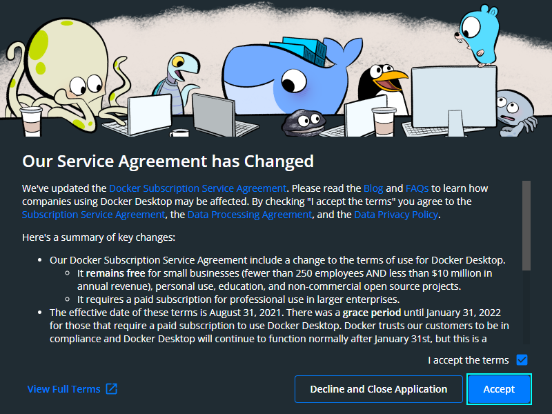

* Una vez que le hemos dado en Aceptar, el siguiente paso que haremos será crear una cuenta en Docker hub y esto lo haremos desde la página de Docker hub para luego dar un clic en el botón de ([**Sign Up**][1_2]) para registrarnos.

[1_2]:https://hub.docker.com/

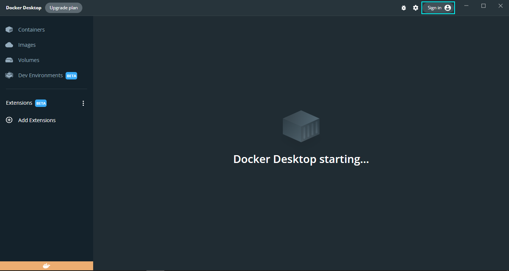

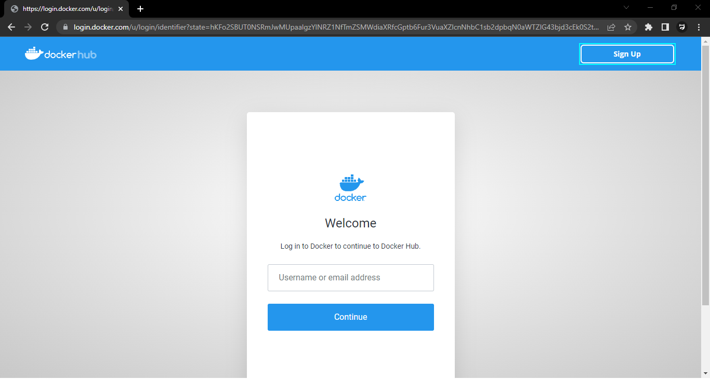

* Aquí registraremos nuestra cuenta de Docker ingresando los datos que este nos pide, los cuales son **Username (nombre de usuario)**, **Email (correo)**, **Password (contraseña)**, y una vez que hemos hecho esto, procederemos a marcar las casillas de **Send me occional producto updates and announcements (enviarme actualizaciones de productos y anuncios ocasionales)** , **I agree tho the Subscription Service Agreement (acepto el acuerdo de servicio de suscripción)** y por ultimo marcaremos la casilla de No soy un robot, luego de esto le daremos un clic izquierdo en el botón de **Sign Up (inscribirse)** para registrar nuestra cuenta.

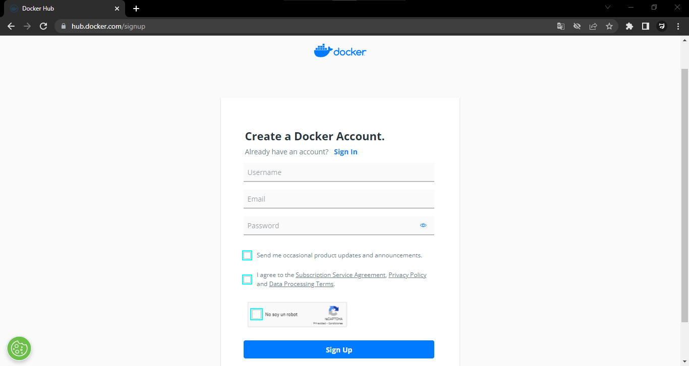

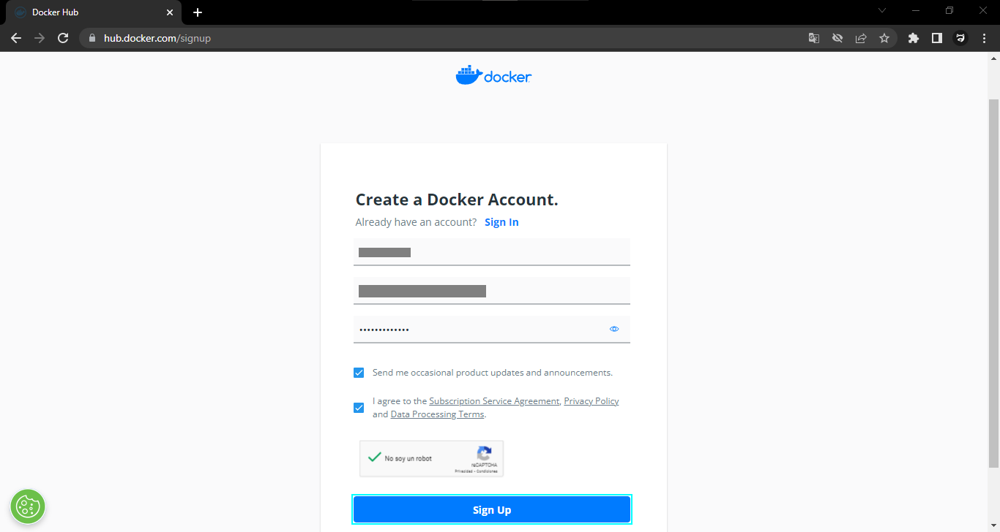

* Una vez que hemos hecho esto, podremos ingresar nuestro nombre de usuario en la ventana de **Welcome (bienvenidos)** y procederemos a dar un clic izquierdo en **Continue (continuar)**.

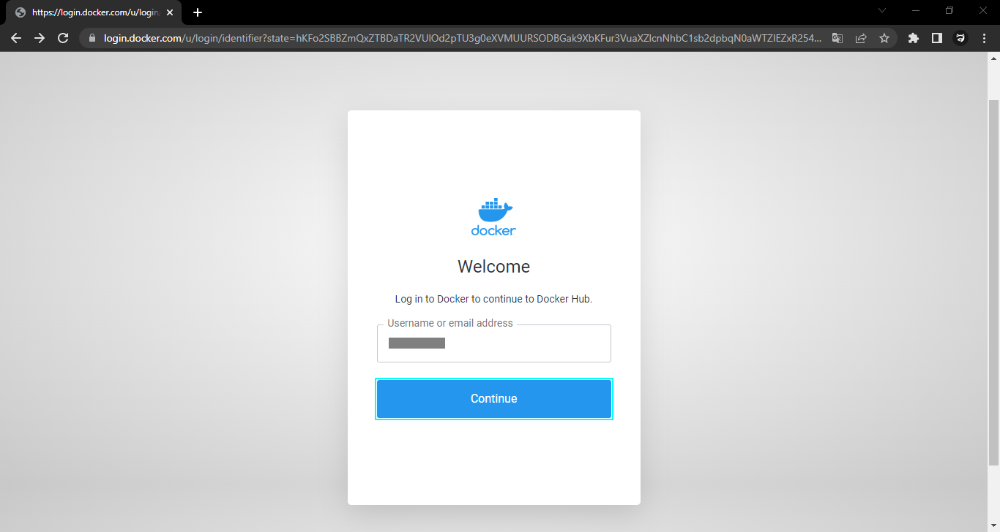

* Luego de esto, nos saldrá una ventana que dice **Enter Your Password (ingresa tu contraseña)** en la cual podremos ingresar la contraseña que creamos anteriormente y acto seguido le daremos un clic en el botón de **Continue**.

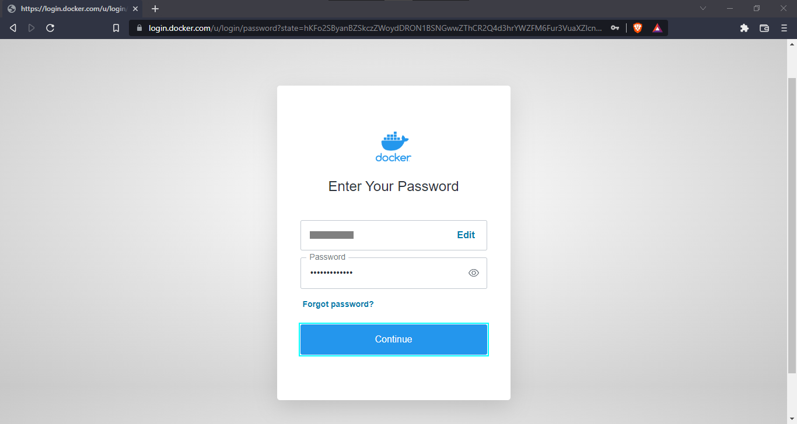

* Después, en este siguiente paso, simplemente tendremos que clasificarnos en el plan que deseamos escoger, ya sea **Personal (personal)**, **Pro (profesional)**, **Team (equipo)** o **Businnes (negocios)**, en nuestro caso seleccionaremos la opción personal.

* Luego de seleccionar el plan, nos enviaran un correo de verificación al correo que registramos anteriormente, el cual tendremos que buscar en nuestra bandeja de entrada, y una vez que lo hemos encontrado procederemos a dar un clic izquierdo en el botón de **Verify email adderss (confirme su dirección de correo electrónico)** para verificar nuestro correo.

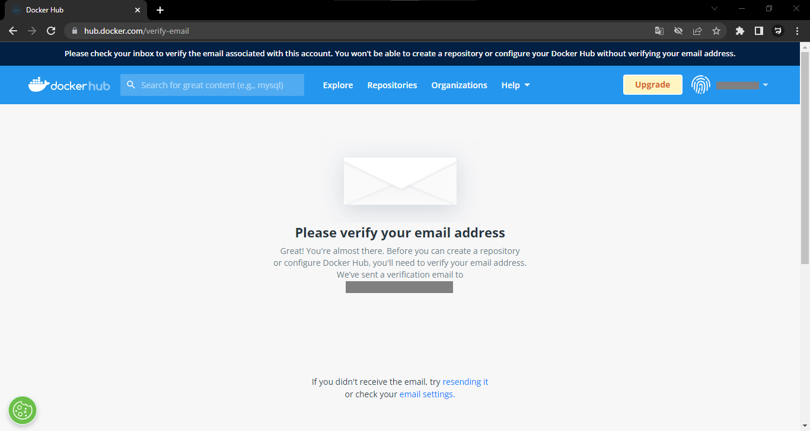

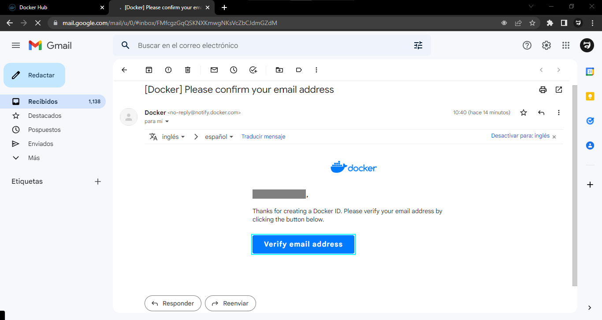

* Y una vez que hemos verificado nuestro correo, ya tendríamos iniciada la sección en nuestra cuenta de Docker.

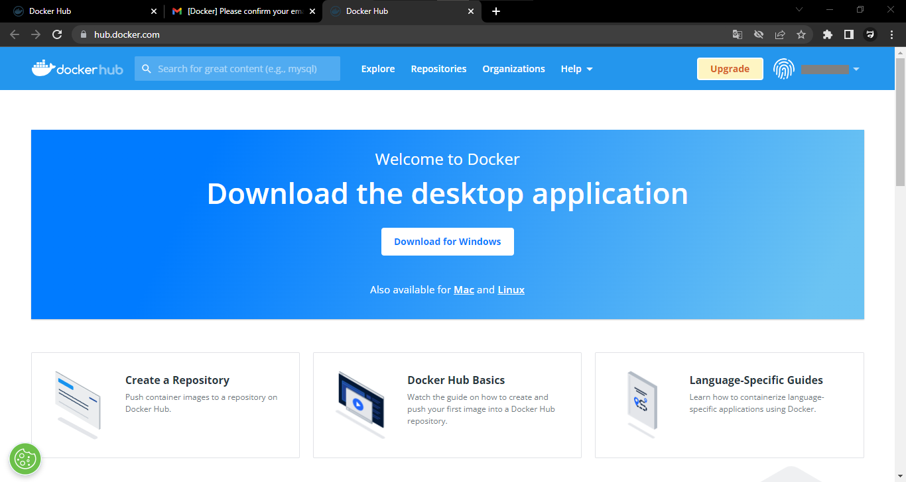

* Después, al momento de ejecutar el Docker Desktop procederemos a iniciar sección dándole un clic izquierdo en el botón de **Sing in (iniciar sesión)**, donde una vez que nos cargue una página que dice **You´re almost done! (¡ya casi terminas!)**, procederemos a dar un clic izquierdo en el botón de **Proceed to Docker Desktop (continuar con docker desktop)**, y acto seguido se nos desplegará una ventana que dice **¿Abir Docker Desktop.exe?** y le daremos clic izquierdo en **Abrir Docker Desktop.exe** accederemos a nuestra cuenta Docker y podremos utilizar normalmente la herramienta.

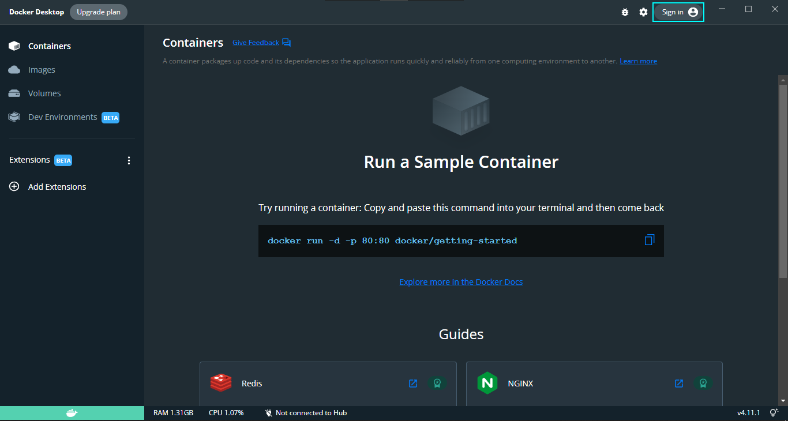

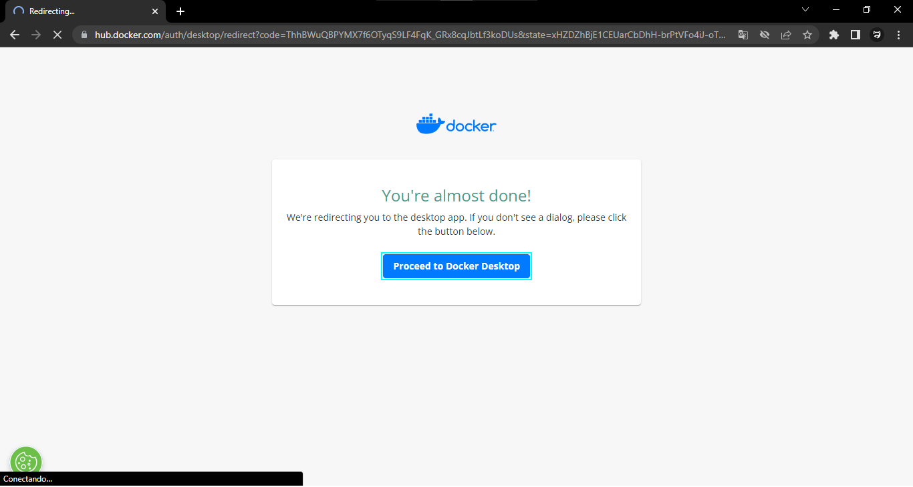

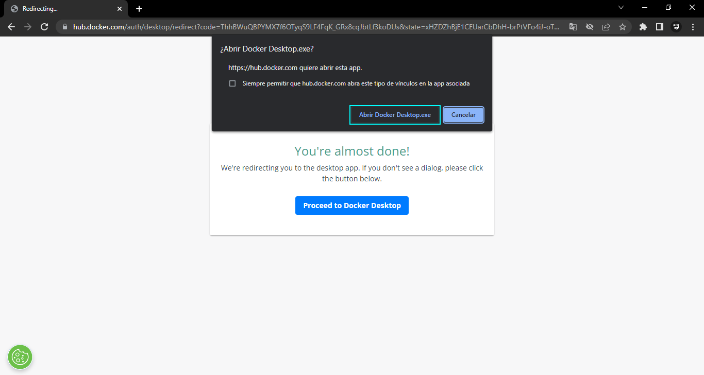

* Y listo, una vez que hemos realizado todos estos pasos, ya tendríamos instalado y configurado nuestro Docker, en nuestro sistema operativo.

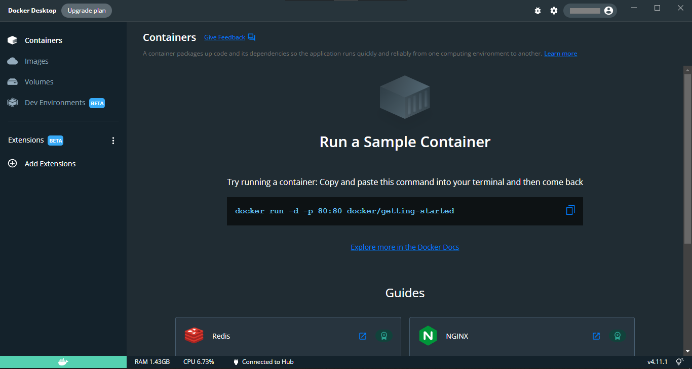

## Mas recursos

* [Docker Documents][1_3]

[1_3]:https://docs.docker.com/desktop/install/windows-install/
